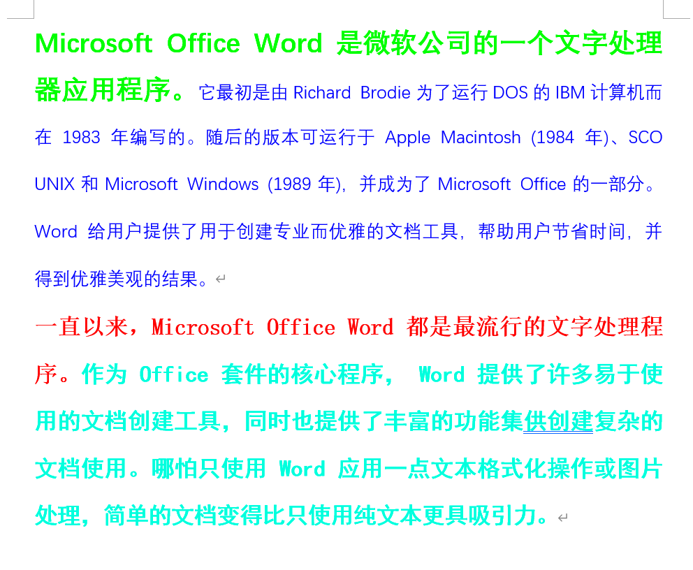
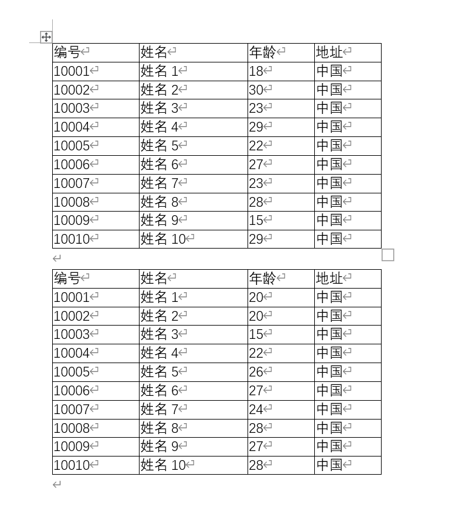

# word

## 概述

Microsoft Office Word是微软公司的一个文字处理器应用程序。

它最初是由Richard Brodie为了运行DOS的IBM计算机而在1983年编写的。随后的版本可运行于Apple Macintosh (1984年)、SCO UNIX和Microsoft Windows (1989年)，并成为了Microsoft Office的一部分。

Word给用户提供了用于创建专业而优雅的文档工具，帮助用户节省时间，并得到优雅美观的结果。

一直以来，Microsoft Office Word 都是最流行的文字处理程序。

作为 Office 套件的核心程序， Word 提供了许多易于使用的文档创建工具，同时也提供了丰富的功能集供创建复杂的文档使用。哪怕只使用 Word 应用一点文本格式化操作或图片处理，简单的文档变得比只使用纯文本更具吸引力。


## POI操作Word的API介绍

poi操作word正文：

 XWPFDocument代表一个docx文档，其可以用来读docx文档，也可以用来写docx文档 

构造方法如下：

```java
public XWPFDocument(OPCPackage pkg) throws IOException {
        super(pkg);

        //build a tree of POIXMLDocumentParts, this document being the root
        load(XWPFFactory.getInstance());
    }

    public XWPFDocument(InputStream is) throws IOException {
        super(PackageHelper.open(is));

        //build a tree of POIXMLDocumentParts, this workbook being the root
        load(XWPFFactory.getInstance());
    }

    public XWPFDocument() {
        super(newPackage());
        onDocumentCreate();
    }
```


一个文档包含多个段落，一个段落包含多个Runs文本，一个Runs包含多个Run，Run是文档的最小单元

获取所有段落：

```java
List<XWPFParagraph> paragraphs = word.getParagraphs();
```


获取一个段落中的所有片段Runs：

```java
List<XWPFRun> xwpfRuns = xwpfParagraph.getRuns();
```


获取一个Runs中的一个Run：

```java
XWPFRun run = xwpfRuns.get(index);
```


poi操作word中的表格：

一个文档包含多个表格，一个表格包含多行，一行包含多列单元格

获取所有表格：

```java
List<XWPFTable> xwpfTables = doc.getTables();
```


获取一个表格中的所有行：

```java
List<XWPFTableRow> xwpfTableRows = xwpfTable.getRows();
```


获取一行中的所有列：

```java
List<XWPFTableCell> xwpfTableCells = xwpfTableRow.getTableCells();
```


获取一格里的内容：

```java
List<XWPFParagraph> paragraphs = xwpfTableCell.getParagraphs();
```


## POI导出word

导出文字：

```java
package mao;

import org.apache.poi.xwpf.usermodel.XWPFDocument;
import org.apache.poi.xwpf.usermodel.XWPFParagraph;
import org.apache.poi.xwpf.usermodel.XWPFRun;

import java.io.FileOutputStream;

/**
 * Project name(项目名称)：java报表_POI导出word
 * Package(包名): mao
 * Class(类名): Test1
 * Author(作者）: mao
 * Author QQ：1296193245
 * GitHub：https://github.com/maomao124/
 * Date(创建日期)： 2023/6/6
 * Time(创建时间)： 20:53
 * Version(版本): 1.0
 * Description(描述)： 无
 */

public class Test1
{
    public static void main(String[] args)
    {
        XWPFDocument xwpfDocument = new XWPFDocument();
        //创建一个段落
        XWPFParagraph paragraph = xwpfDocument.createParagraph();
        //创建一个片段
        XWPFRun run = paragraph.createRun();
        //设置颜色
        run.setColor("00ff00");
        //大小
        run.setFontSize(18);
        //加粗
        run.setBold(true);
        //文本
        run.setText("Microsoft Office Word是微软公司的一个文字处理器应用程序。");
        //创建一个片段
        run = paragraph.createRun();
        //设置颜色
        run.setColor("0000ff");
        //大小
        run.setFontSize(12);
        //加粗
        run.setBold(false);
        //文本
        run.setText("它最初是由Richard Brodie为了运行DOS的IBM计算机而在1983年编写的。" +
                "随后的版本可运行于Apple Macintosh (1984年)、" +
                "SCO UNIX和Microsoft Windows (1989年)，并成为了Microsoft Office的一部分。" +
                "Word给用户提供了用于创建专业而优雅的文档工具，帮助用户节省时间，并得到优雅美观的结果。");

        //创建一个段落
        paragraph = xwpfDocument.createParagraph();
        //创建一个片段
        run = paragraph.createRun();
        //设置颜色
        run.setColor("ff0000");
        //大小
        run.setFontSize(15);
        //加粗
        run.setBold(true);
        //字体
        run.setFontFamily("宋体");
        //文本
        run.setText("一直以来，Microsoft Office Word 都是最流行的文字处理程序。");
        //创建一个片段
        run = paragraph.createRun();
        //设置颜色
        run.setColor("00ffcc");
        //大小
        run.setFontSize(15);
        //加粗
        run.setBold(true);
        //字体
        run.setFontFamily("黑体");
        //文本
        run.setText("作为 Office 套件的核心程序， Word 提供了许多易于使用的文档创建工具，" +
                "同时也提供了丰富的功能集供创建复杂的文档使用。哪怕只使用 Word 应用一点文本格式化操作或图片处理，" +
                "简单的文档变得比只使用纯文本更具吸引力。\n" +
                "\n");

        

        try (FileOutputStream fileOutputStream = new FileOutputStream("./out.docx"))
        {
            xwpfDocument.write(fileOutputStream);
            xwpfDocument.close();
        }
        catch (Exception e)
        {
            e.printStackTrace();
        }
    }
}

```





导出表格：

```java
package mao;

import org.apache.poi.xwpf.usermodel.XWPFDocument;
import org.apache.poi.xwpf.usermodel.XWPFTable;
import org.apache.poi.xwpf.usermodel.XWPFTableCell;
import org.apache.poi.xwpf.usermodel.XWPFTableRow;

import java.io.FileOutputStream;

/**
 * Project name(项目名称)：java报表_POI导出word
 * Package(包名): mao
 * Class(类名): Test2
 * Author(作者）: mao
 * Author QQ：1296193245
 * GitHub：https://github.com/maomao124/
 * Date(创建日期)： 2023/6/6
 * Time(创建时间)： 21:14
 * Version(版本): 1.0
 * Description(描述)： 无
 */

public class Test2
{

    /**
     * 得到int随机
     *
     * @param min 最小值
     * @param max 最大值
     * @return int
     */
    public static int getIntRandom(int min, int max)
    {
        if (min > max)
        {
            min = max;
        }
        return min + (int) (Math.random() * (max - min + 1));
    }

    public static void main(String[] args)
    {
        XWPFDocument xwpfDocument = new XWPFDocument();

        createTable(xwpfDocument);

        xwpfDocument.createParagraph().createRun().setText("");

        createTable(xwpfDocument);

        try (FileOutputStream fileOutputStream = new FileOutputStream("./out2.docx"))
        {
            xwpfDocument.write(fileOutputStream);
            xwpfDocument.close();
        }
        catch (Exception e)
        {
            e.printStackTrace();
        }
    }

    /**
     * 创建表格
     *
     * @param xwpfDocument xwpf文档
     */
    private static void createTable(XWPFDocument xwpfDocument)
    {
        //创建表格
        XWPFTable table = xwpfDocument.createTable(11, 4);
        table.setWidth(5000);
        //创建行
        XWPFTableRow row = table.getRow(0);
        //创建单元格
        XWPFTableCell cell = row.getCell(0);
        //文本
        cell.setText("编号");
        //创建单元格
        cell = row.getCell(1);
        //文本
        cell.setText("姓名");
        //创建单元格
        cell = row.getCell(2);
        //文本
        cell.setText("年龄");
        //创建单元格
        cell = row.getCell(3);
        //文本
        cell.setText("地址");

        for (int i = 1; i < 11; i++)
        {
            //创建行
            row = table.getRow(i);
            //创建单元格
            cell = row.getCell(0);
            //宽度
            //cell.setWidth("12");
            //文本
            cell.setText(String.valueOf(10000 + i));
            //创建单元格
            cell = row.getCell(1);
            //文本
            cell.setText("姓名" + i);
            //创建单元格
            cell = row.getCell(2);
            //文本
            cell.setText(String.valueOf(getIntRandom(15, 30)));
            //创建单元格
            cell = row.getCell(3);
            //文本
            cell.setText("中国");
        }
    }
}
```





